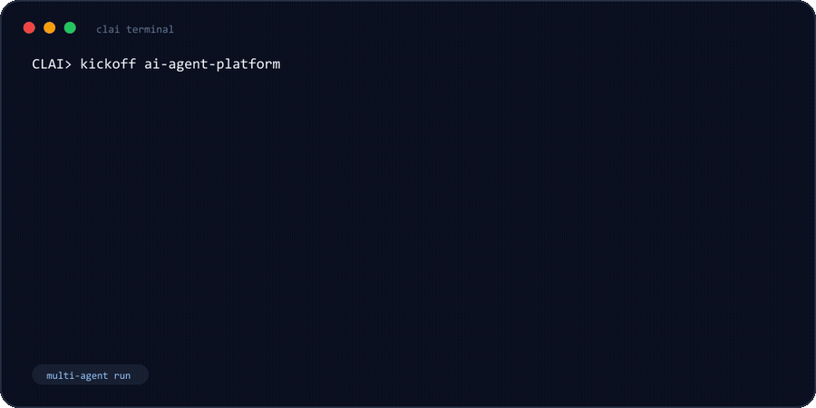
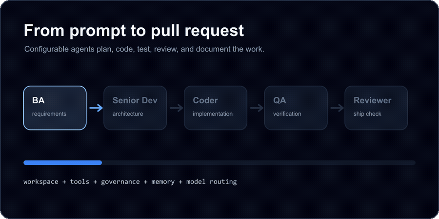

# CLAI

<p align="center">
  <strong>A configurable multi-agent AI engineering team for your terminal and browser.</strong>
</p>

<p align="center">
  <a href="LICENSE"></a>
  
  
  
  
</p>

<p align="center">
  
</p>

CLAI turns a product request into a coordinated engineering workflow. A senior
architect, business analyst, coders, QA, and reviewer can plan, implement, test,
review, and document work while using real tools against your local workspace.

## Highlights

- Multi-agent delivery workflows for planning, implementation, QA, review, and handoff.
- Configurable model teams: `cheap`, `optimal`, and `expensive` presets.
- Provider routing across Anthropic, OpenAI, Google Gemini, Kimi, and OpenRouter.
- Tool controls for filesystem access, scratchpad memory, enterprise data, QA tools, and GitHub MCP.
- Local enterprise data layer for catalog search, semantic retrieval, knowledge graph facts, audit logs, memory, prompt cache, and cost estimates.
- Terminal shell, CLI commands, and a Next.js web UI over a FastAPI backend.

## Workflow

<p align="center">
  
</p>

```text
You describe the goal
        |
        v
BA -> Senior Dev -> Coder -> QA -> Reviewer
        |
        v
Issues, files, tests, PR notes, delivery docs
```

## Quick Start

```powershell
git clone https://github.com/Waleeeeed88/CLAI.git
cd CLAI

python -m venv venv
.\venv\Scripts\Activate.ps1
pip install -r requirements.txt

Copy-Item .env.example .env
# Edit .env with the provider keys you want to use.

python shell.py
```

For the web UI:

```powershell
python web.py
cd frontend
npm install
npm run dev
```

## Agent Team

| Role | Mention | Default responsibility |
| --- | --- | --- |
| Senior Dev | `@senior` | Architecture, tradeoffs, delivery direction |
| Coder | `@dev` | Primary implementation |
| Coder 2 | `@dev2` | Secondary implementation and large-context coding |
| Coder 3 | `@dev3` | Extra coding pass with alternate provider routing |
| QA | `@qa` | Test strategy, test plans, verification |
| BA | `@ba` | Requirements, user stories, issue shaping |
| Reviewer | `@reviewer` | Code review and release confidence |

## Model Teams

CLAI ships with three complete routing presets:

| Preset | Use it for |
| --- | --- |
| Cheap Team | Low-cost triage, drafts, and routine iterations |
| Optimal Team | Balanced day-to-day product work |
| Expensive Team | Architecture, high-risk changes, and final review |

You can also override every role manually from `.env`, `config/overrides.json`,
or the web Settings drawer.

```ini
ANTHROPIC_API_KEY=sk-ant-...
OPENAI_API_KEY=sk-...
GOOGLE_API_KEY=AI...
KIMI_API_KEY=sk-...
OPENROUTER_API_KEY=sk-or-...

ROLE_PROVIDER_OVERRIDES={"coder": "openrouter"}
ROLE_MODEL_OVERRIDES={"coder": "~anthropic/claude-sonnet-latest"}
```

## Tooling

Agents use structured tool calls, not prompt-only simulations.

| Tool set | What it enables |
| --- | --- |
| Filesystem | Read, write, search, and inspect workspace files |
| Scratchpad | Cross-step working memory |
| Enterprise Data | Catalog, graph, semantic search, memory, governance, audit, cost controls |
| QA Tools | Excel test plans and test runner access |
| GitHub MCP | Repository, branch, issue, pull request, and review workflows |

Tool access can be toggled from configuration so a cheap drafting run does not
need the same capabilities as a full delivery run.

## Common Commands

```text
@senior design a REST API for user auth
@dev implement that in Python > auth_api.py
@qa review this < auth_api.py

workflow feature
kickoff my-auth-api
@team should this be REST or GraphQL?

tools
config
team
workspace
```

## Project Layout

```text
CLAI/
  agents/      Provider adapters and agent factory
  config/      Settings, model routing, team presets
  core/        Orchestrator, pipeline, tools, enterprise data layer
  frontend/    Next.js UI
  roles/       Role prompts and runtime defaults
  shell/       Interactive terminal shell
  web/         FastAPI routes and schemas
  workspace/   Sandboxed working directory
```

## Documentation

- [Usage Guide](docs/USAGE_GUIDE.md) - commands, workflows, tools, config, and extension points.
- [Onboarding](onboarding.md) - developer walkthrough for the codebase.

## Development

```powershell
.\venv\Scripts\python.exe -m pytest
.\venv\Scripts\python.exe -m compileall config core web tests cli.py shell.py

cd frontend
npm run build
```

## Contributing

Issues and pull requests are welcome. Keep changes focused, include a small
test or verification note when behavior changes, and prefer existing patterns
over new abstractions.

## License

MIT. See [LICENSE](LICENSE).
